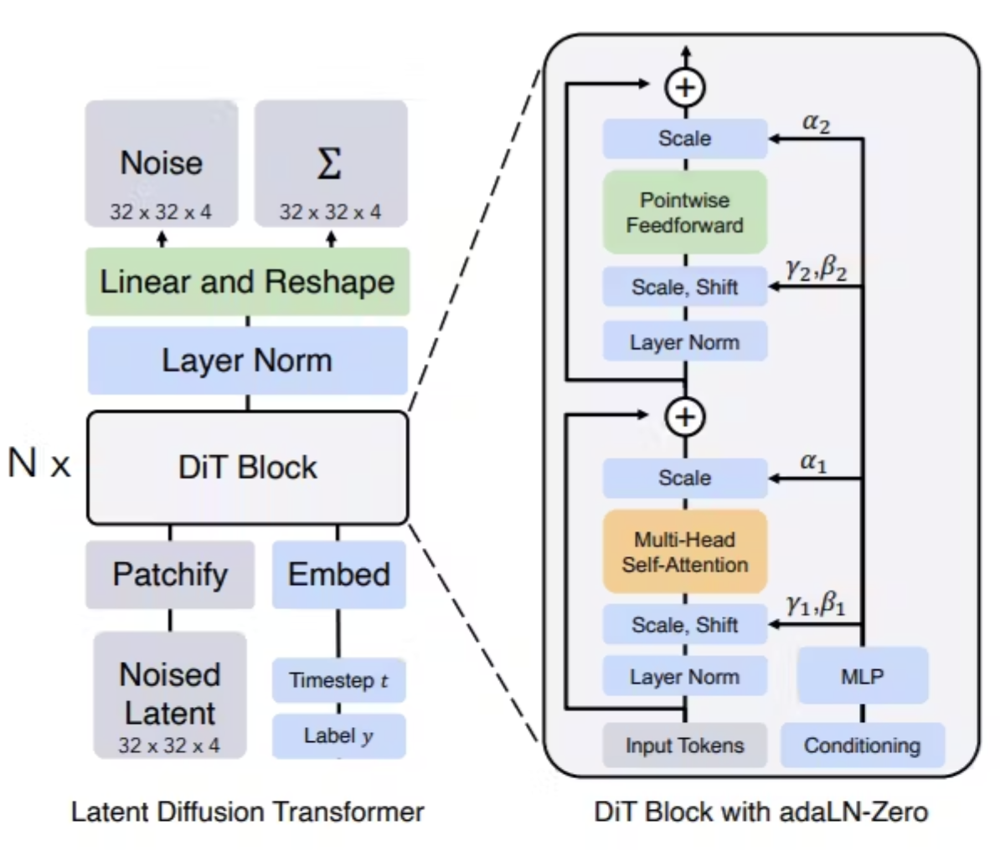
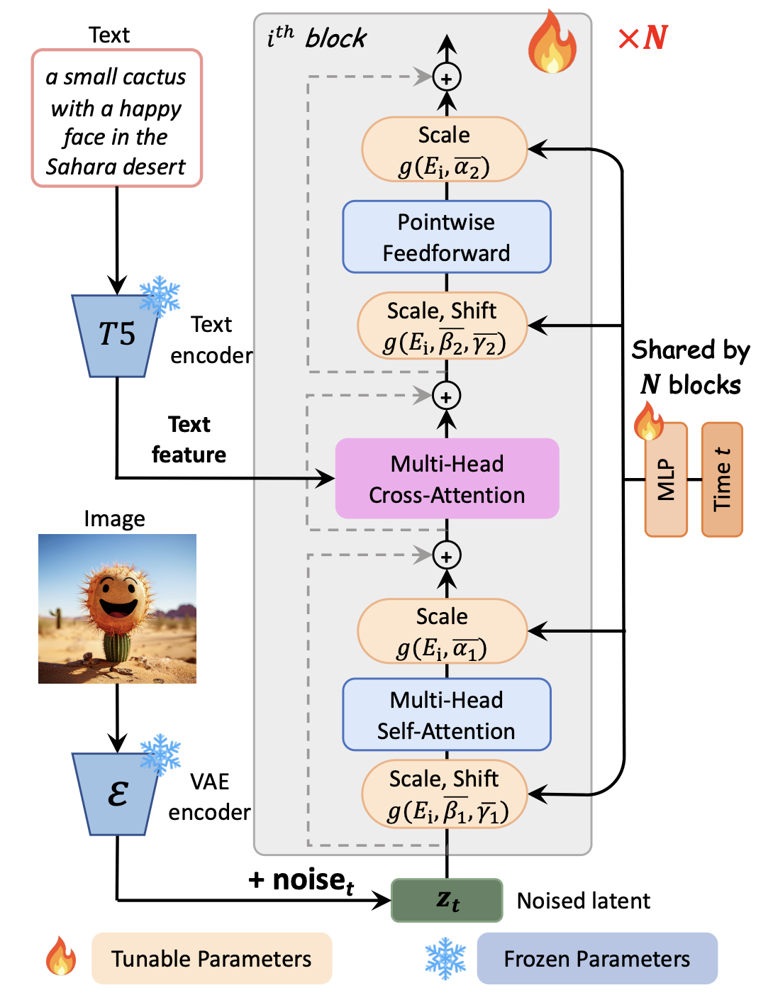

# Text-To-Image-Diffusion-Transformer
- Implementation of each block from scratch, below is the representation of the Architecture.

- Text to Image Generation Block

## My Architecture
- Step 1, I won't use a single Text Encodings, I would use multiple Text Encodings, so as to understand the context of text is richer. It is evident that the reacher your Text Embeddings are better is the Generated Image from it (SD3 uses multiple Text Encoders).
- I am using GPT-Neo, T5, and CLIP
- Concatenated them, and added a output later of embedding dimension 
- Outputs the Text Embeddings

- Step 2, Image Encodings
