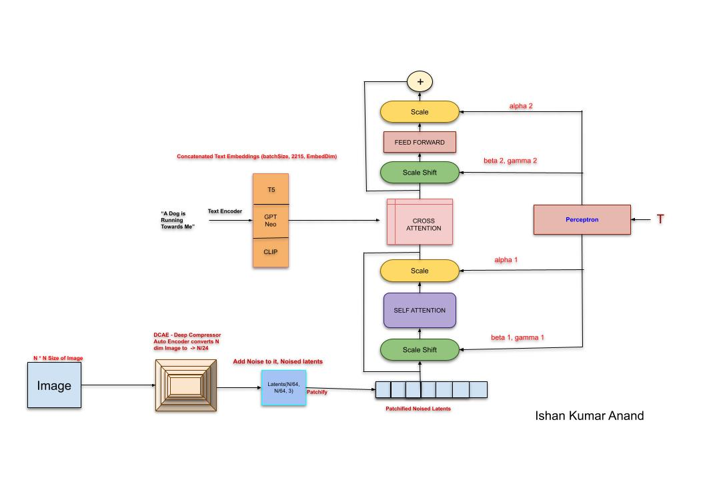
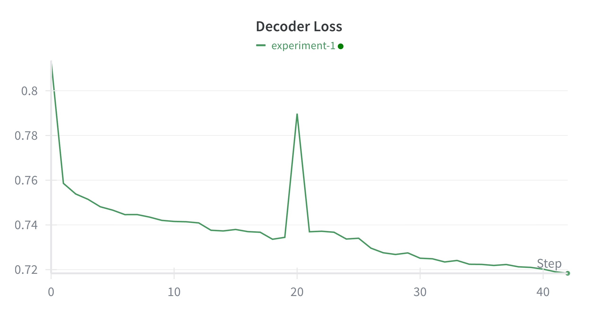

# Text-To-Image Diffusion Transformer (DiT)

This project describes my implementation of a **Text-to-Image Diffusion Transformer** from scratch. It outlines the architecture, implementation details of each block, and experimental results. I have few modifications and tweaks in the Architecture, 

---

## Architecture Overview

* **Full Architecture Representation**
  

---

## My Implementation

### Step 1: Multiple Text Encoders
* Instead of a single text encoder, I use **multiple text encoders** for richer semantic understanding.
* Encoders used: GPT NEO, T5, CLIP
* Outputs of all encoders are concatenated.
* Added a projection layer to match the final embedding dimension.
* Final Output: Text embeddings (batchSize, 2125, Embeding Dimension).
* The Text Embedding will be an Input to Cross Attention Block of the Transfomer.


### Step 2: Image Encodings
* Use pretrained Architecture and weights of most advance Image Encoder out there as of Today, which is Deep Compression Auto Encoder.
* It compresses any Image to the image by /64th of it's dimension
* It is the most recent available State of the Art Image Encoder Available
* The Input Image of dimension (N, N, 3) is compressed to (N/64, N/ 64, 3)
* This Image Embeddings are then transferred for Noising.


### Step 3: Noise Addition to Latents and patchification

* Implemented Noise addition at random timestep *t* using DDPM with a cosine beta scheduler.
* Added Time embedding block:
* Uses **sinusoidal embeddings** to incorporate phase information.
* For a batch of timesteps `t`, outputs `(batch, embed_dim)`.
* Current `embed_dim = 768`.
* Noised latents are converted into patches each of size `4`.
* Patches are flattened and added to positional encodings.
* Resultant embeddings are fed into the DiT input layer.
* Implemented both patchify and unpatchify (reverse using ConvTranspose2D).

### Step 5: DiT Block
* Noised Patchified latents are fed to the Scale Shift block, which has parameters beta1, gamma1 shared from Time EMbeding Matrix.
* Which is then processed with Self Attention Layer, among the Image Latents, and preprocessed in it.
* After which the preprocessed latents are passed through Scale Block parameterized by alpha1 vector which is chunked from Time Embedding.
* Next comes the Multi head Cross Attention Block which takes input of Text EMbeddings, Image Latents and also Time Embeddings of that current step
* The cross attention basically helps in calculation of the dependency of Image latents of Text Embeddings over entire batch of dataset.
* This output is again followed by a Scale Shift block, a Feed Forward Network and a Scale block which has parameters alpha2, beta2 and gamma2 from Time Embedding Vectors.
* There are 2 skip connections in between the blocks one prior to the Cross Attention Block and input Latents and the other Next to the Cross Attention Block and output Embeddings.
  ```
  ScaleShift → Multi-Head Self-Attention → Scale →
  Multi-Head Cross-Attention → ScaleShift → Feed Forward Block → Scale
  ```

### Step 7: Decoder & Output
* Standard DiT predicts **only noise**.
* Initially considered training with **two losses** (noise + image reconstruction), but rejected it since it introduces **multiple objectives**, causing instability in learning.
* So, currently predicting Noise as output from the DiT Block.
* Now Decoder Module takes Input of a Random Noise and A text, and the Denoising steps starts. We denoise it from 1000->0 backward and remove the predicted Noise at each iteration. 
* Also considering that at each iteration a little residual of Noise is also added so as to be the output bit Dynamic and oriented towards the text.

---

## Results
  * Currently it is in progress of Training
  

  * Prompt: *"A dog is running towards me"*
  * Output:

  


---